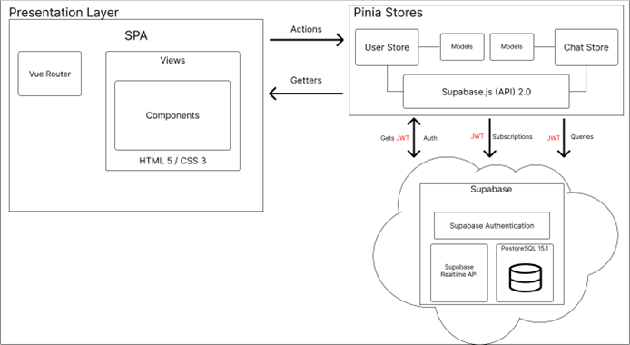

# GeoComs

With so much technology introduced in the world today, it is often difficult to connect and communicate with people who are around you. GeoComs is a project that is aimed at decreasing this social barrier and making it more common to connect with people around you through technology. GeoComs will be a Progressive Web Application (PWA) that allows users to create chat rooms based on their geographic location. Other users will be able to join a created group chat if they are in the same geographic location. In these newly created group chats, users will be able to send messages to further develop a relationship amongst themselves. The goal of GeoComs is to provide a space in the technology world for people to share a wide variety of messages with those around them.

GeoComs will actively obtain a user's location and use that location to create or join chat rooms. When a chat room is created, the location that the user was at is stored along with the rest of the chat room information. When joining a chat room, GeoComs will find all chat rooms that are within 50 meters of the user and they will be made available to join. Once the user joins a chat room, they will be able to participate in Realtime messaging with other members in the chat room.

GeoComs is hosted on the Contend Delivery Network (CDN) Netlify, and can be accessed at https://geocoms.app.

## Technologies

- Vue.js
- JavaScript
- HTML 5
- CSS
- Supabase
- PostgreSQL
- Vite
- Pinia
- Netlify

I chose Vue.js as my JavaScript framework for this project because of its simplicity and effectiveness in developing code on the client. With this project, I was able to further extend my knowledge of Vue.js by pairing it with the global state management system Pinia. For the backend of the project I chose to use the back-end-as-a-service platform Supabase. While using this platform I learned about row level security (RLS), triggers, and PostgreSQL functions. This platform also allows GeoComs to update data in Realtime.

## Logical Solution Design

The Logical Solution Design displayed below begins with the Presentation Layer which contains a single page application (SPA). This SPA contains the Vue Router which is in charge of navigating to the many views on the application. Each view contains many components, and this is all made up of HTML 5 and CSS 3. The Presentation Layer communicates with the Pinia Stores through actions and getters. Actions are methods in the stores that are called when the SPA would like to change something while getters simply get the current state of a model and send it to the SPA. Currently there are 2 stores within the GeoComs application, and these are the User Store and the Chat Store. Both of these stores contain models, and they are both connected to the Supabase.js API which is the client that talks to the Supabase back-end-as-a-service. The communication between the stores and the Supabase back-end requires a JWT token, and this token is obtained by authenticating a user through Supabase’s authentication method. Once a JWT token is acquired, the stores can now communicate with the Supabase back-end via queries and subscriptions.

## General Technical Approach

The overall design of the GeoComs application was done in a way that highlights unique features while also providing a familiar environment to users that have used other chat applications. This design strategy begins with the design of the database. I have designed a simple yet efficient relational database that allows users to add unique data about themselves, but not requiring that data. This application will allow users to effortlessly sign up for the application using only their email, requiring no additional information for full access. The overall UI should be easy for the user to understand and navigate smoothly between pages. Efficiency was a priority in the process of creating components for the GeoComs application. This means that when creating a component, the developer should make that component reusable in other ways by allowing different style properties on the component. The UI must be completely responsive and function as if it were a native application to any mobile platform.

## Functional Requirements

- **Registration**
- **Login**
- **User Controls**
  - Edit User
  - Promote to Admin
  - Promote to Owner
  - Demote to Chat Room Member
  - Remove from Chat Room
- **Get Location Data**
- **Chat Rooms**
  - Create Chat Room
  - Join Chat Room
  - Leave Chat Room
  - Edit Chat Room
  - View Available Chat Rooms
  - Delete Chat Room
- **Chat Messages**
  - Create Message
  - View Chat Message
  - Edit Chat Message
  - Delete Chat Message

## Non-Functional Requirement

- GeoComs was developed as a Progressive Web Application (PWA). Meaning that it can be installed natively from a WebKit browser and can operate like any platform-specific application.

## Risks and Challenges

While developing this project I understood that I was taking a risk in requiring a user's location to be so important in the overall functionality of the application. This meant that I needed to get familiar with the JavaScript GeoLocation API and understand what constraints I might face when accessing this data. One of the obvious constraints is that when you are given a user's location data you are also given their location accuracy. This data property represented the accuracy in meters that their exact longitude and latitude could be within. This was clearly a challenge that I needed to think about when writing the logic that relies so heavily on a user's distance away from chat rooms. To overcome this challenge I factored in location accuracy into my equation that calculates maximum and minimum latitudes and longitudes within the set 50 meter distance that GeoComs is set at.

## Issues

There are currently no outstanding issues with the GeoComs application. While my Capstone Project is complete, I do plan on adding further enhancements to the application in the future.
